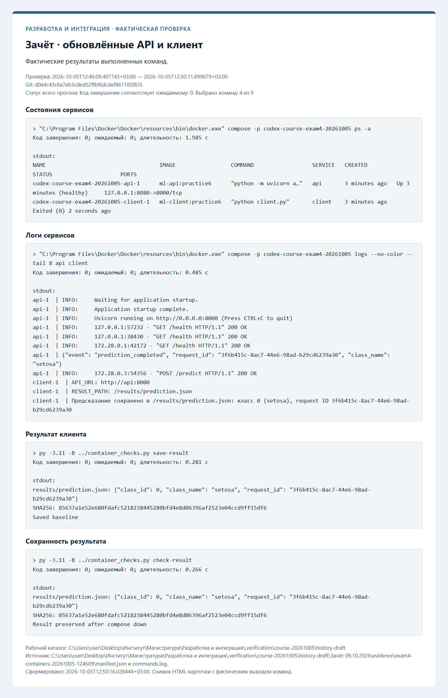
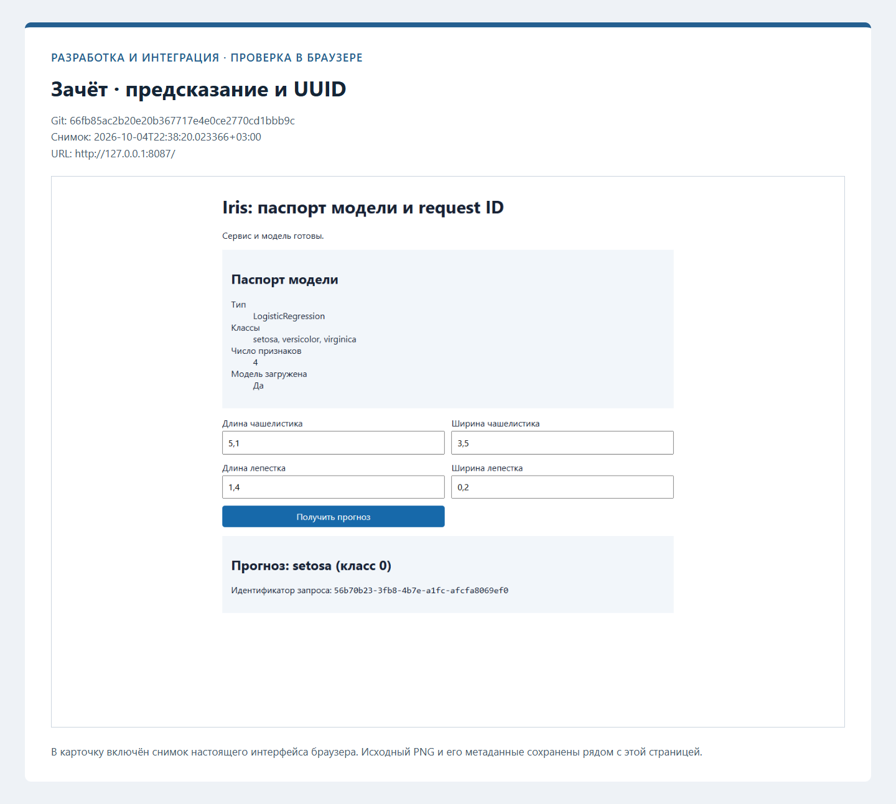
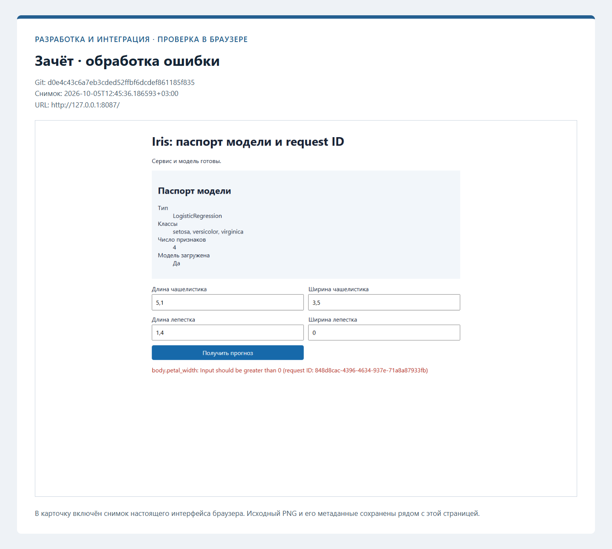
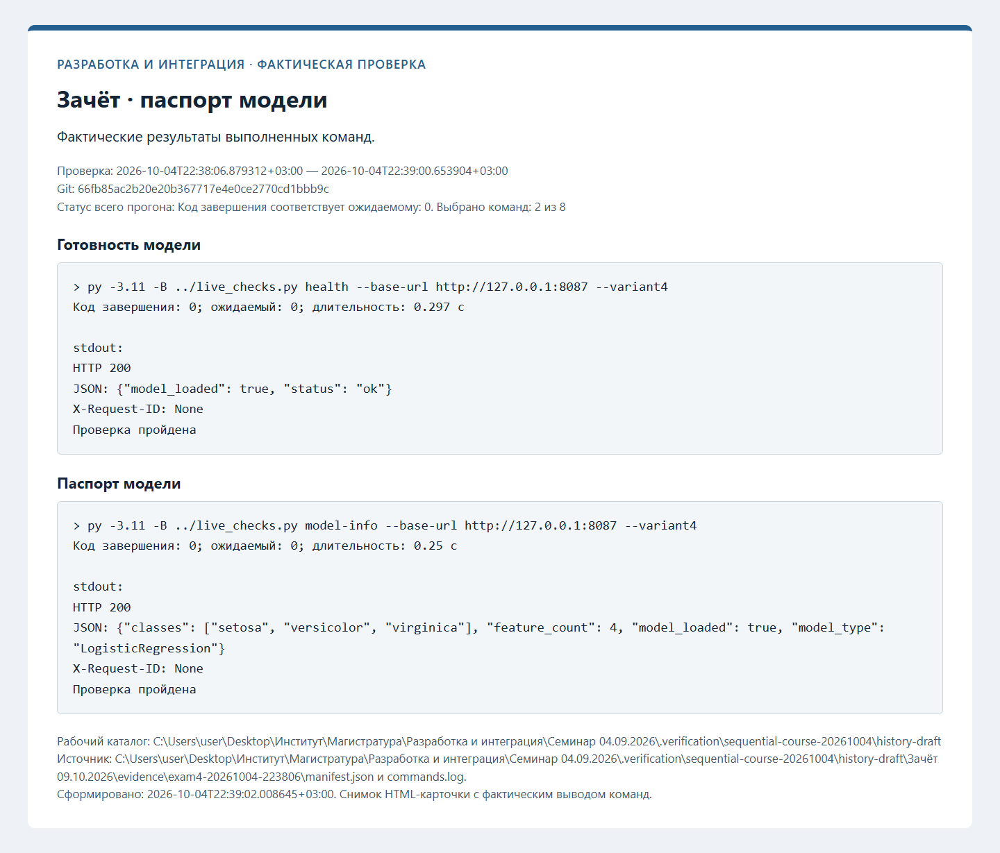
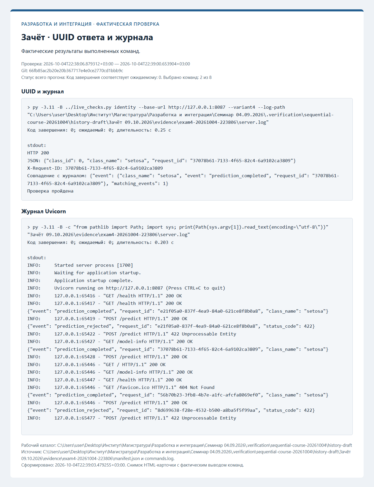
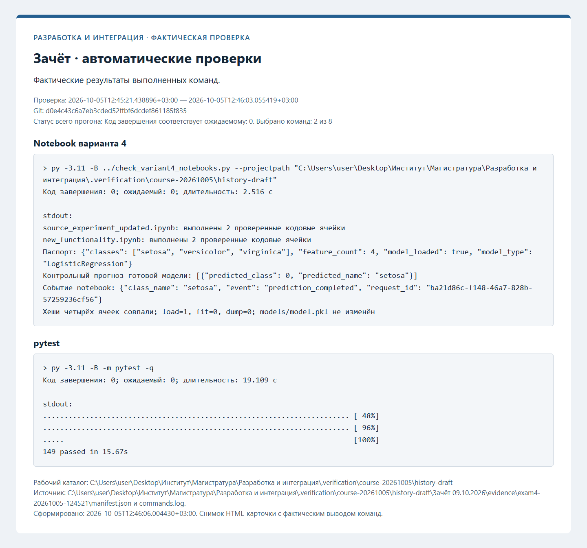

# Протоколы проверок

Ниже сохранены протоколы фактических проверок. Незавершённые этапы обозначены отдельно. Записи ранних практик при
добавлении следующей сохраняются; старые SHA и runs из прежней истории не переносятся.

## Зачёт: вариант 4 — фактическая проверка

Проверенный коммит: `d0e4c43c6a7eb3cded52ffbf6dcdef861185f835`. Дата: 2026-10-05T12:45:21.438896+03:00.

| Проверка | Фактический код | Результат |
| --- | --- | --- |
| Готовность модели | 0 | succeeded |
| Контрольный прогноз | 0 | succeeded |
| Ошибка валидации | 0 | succeeded |
| Паспорт модели | 0 | succeeded |
| UUID и журнал | 0 | succeeded |
| Журнал Uvicorn | 0 | succeeded |
| Notebook варианта 4 | 0 | succeeded |
| pytest | 0 | succeeded |

[Полный журнал](evidence/exam4-20261005-124521/commands.log), [манифест](evidence/exam4-20261005-124521/manifest.json).

[Новый pull request](https://github.com/Kirill-Erofeev/development-and-integration-labs/pull/34).

[Учебный саморазбор автора](https://github.com/Kirill-Erofeev/development-and-integration-labs/pull/34#issuecomment-5992089960) выполнен по согласованному исключению. Проверены паспорт, UUID, обработка ошибок и использование готовой модели. Независимое ревью не заявляется.

[GitHub ci для проверенного коммита PR](https://github.com/Kirill-Erofeev/development-and-integration-labs/actions/runs/37292691408) — success.

[GitHub publish-api-docs для проверенного коммита PR](https://github.com/Kirill-Erofeev/development-and-integration-labs/actions/runs/37292691381) — success.

Контейнерная проверка того же коммита:

| Проверка | Фактический код | Результат |
| --- | --- | --- |
| Сборка API и клиента | 0 | succeeded |
| Запуск Compose | 0 | succeeded |
| Готовность API | 0 | succeeded |
| Завершение клиента | 0 | succeeded |
| Состояния сервисов | 0 | succeeded |
| Логи сервисов | 0 | succeeded |
| Результат клиента | 0 | succeeded |
| Остановка Compose | 0 | succeeded |
| Сохранность результата | 0 | succeeded |

[Журнал Compose](evidence/exam4-containers-20261005-124609/commands.log), [манифест Compose](evidence/exam4-containers-20261005-124609/manifest.json).

## GitHub после интеграции зачёта

Проверен `main` на коммите `6dfab1c6e779e05a3c927d0bcd09f8b7c8fb2e9e`.

- [CI: pytest и сборка двух образов](https://github.com/Kirill-Erofeev/development-and-integration-labs/actions/runs/37293482130) — success.
- [Pages: сборка и публикация](https://github.com/Kirill-Erofeev/development-and-integration-labs/actions/runs/37293482108) — success.
- Опубликованная схема сопоставлена с локальным экспортом; HTML, JSON, CSS и JS доступны по HTTP 200.

Метаданные сохранены в [docs/evidence/final](../docs/evidence/final/).
