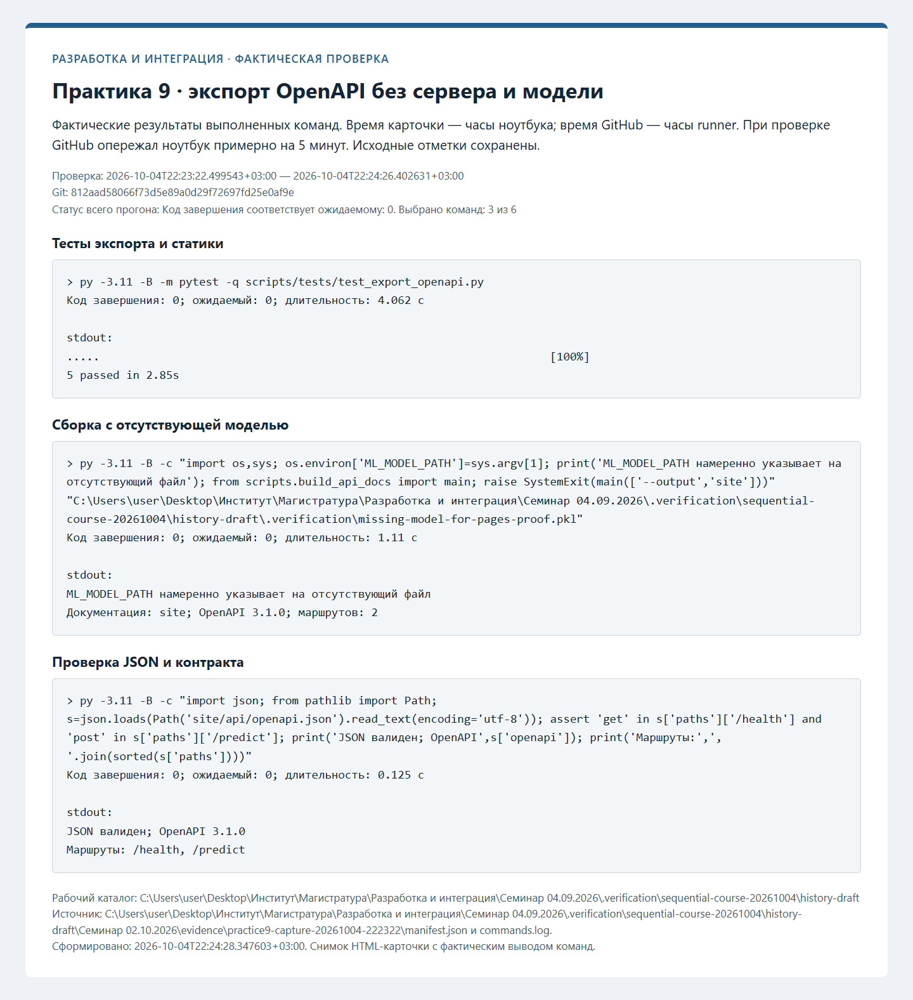
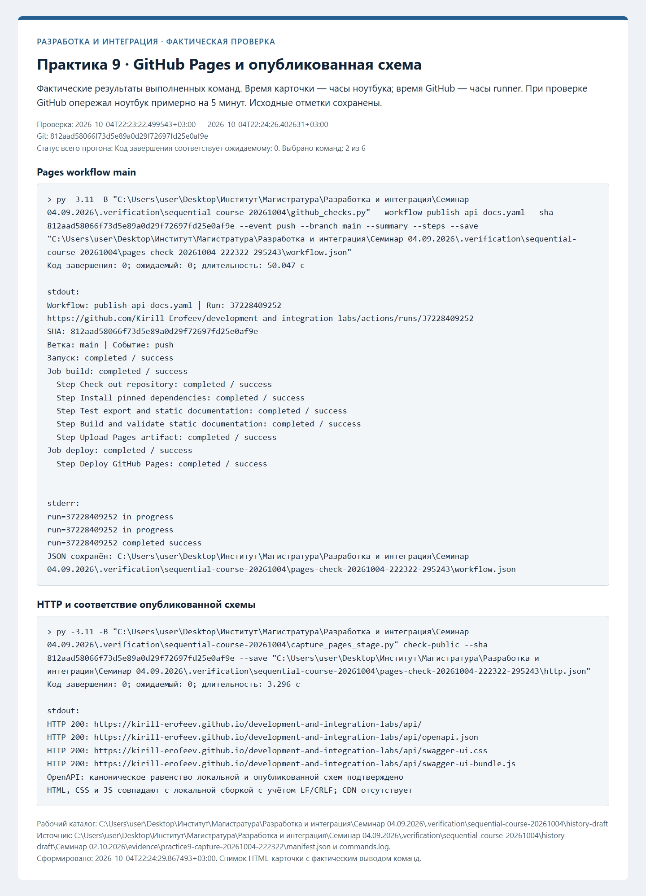
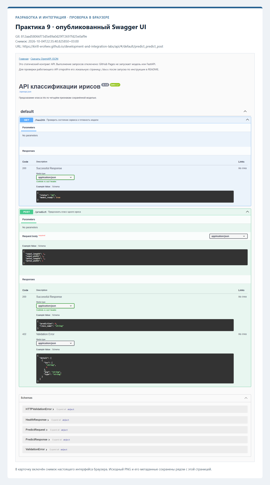

# Протоколы проверок

Ниже сохранены протоколы фактических проверок. Незавершённые этапы обозначены отдельно. Записи ранних практик при
добавлении следующей сохраняются; старые SHA и runs из прежней истории не переносятся.

## Swagger UI и Pages — фактическая проверка

Проверенный коммит: `812aad58066f73d5e89a0d29f72697fd25e0af9e`. Дата: 2026-10-04T22:23:22.499543+03:00.

| Проверка | Фактический код | Результат |
| --- | --- | --- |
| Тесты экспорта и статики | 0 | succeeded |
| Сборка с отсутствующей моделью | 0 | succeeded |
| Проверка JSON и контракта | 0 | succeeded |
| Pages workflow main | 0 | succeeded |
| HTTP и соответствие опубликованной схемы | 0 | succeeded |
| Повторная проверка Pages run | 0 | succeeded |

[Полный журнал](evidence/practice9-capture-20261004-222322/commands.log), [манифест](evidence/practice9-capture-20261004-222322/manifest.json).

[Новый pull request](https://github.com/Kirill-Erofeev/development-and-integration-labs/pull/18).

