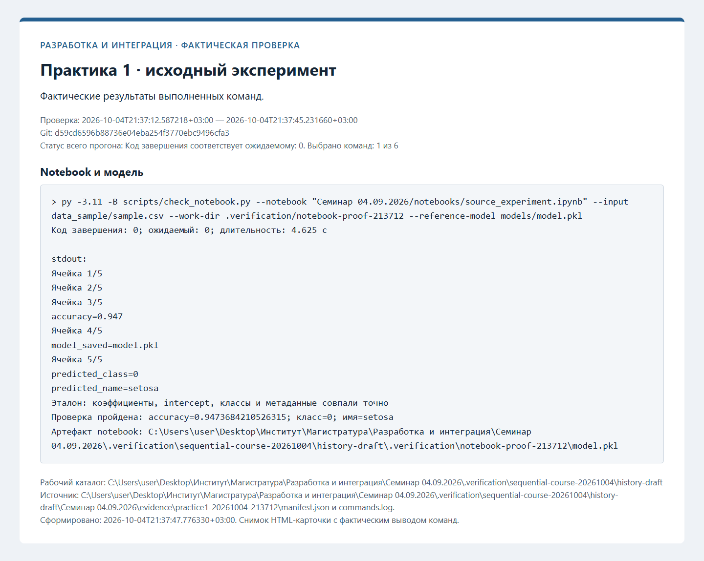
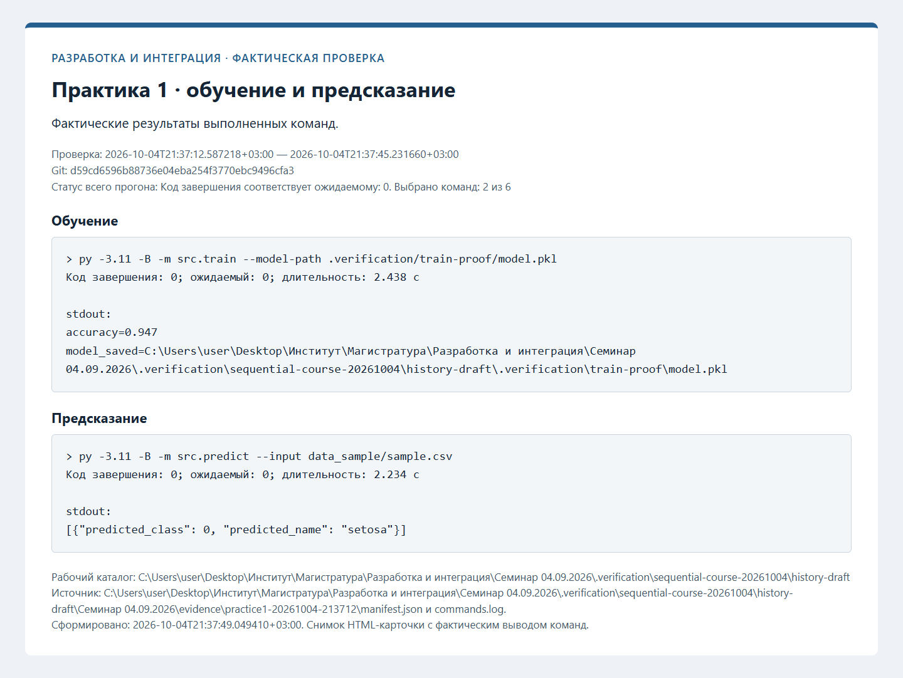
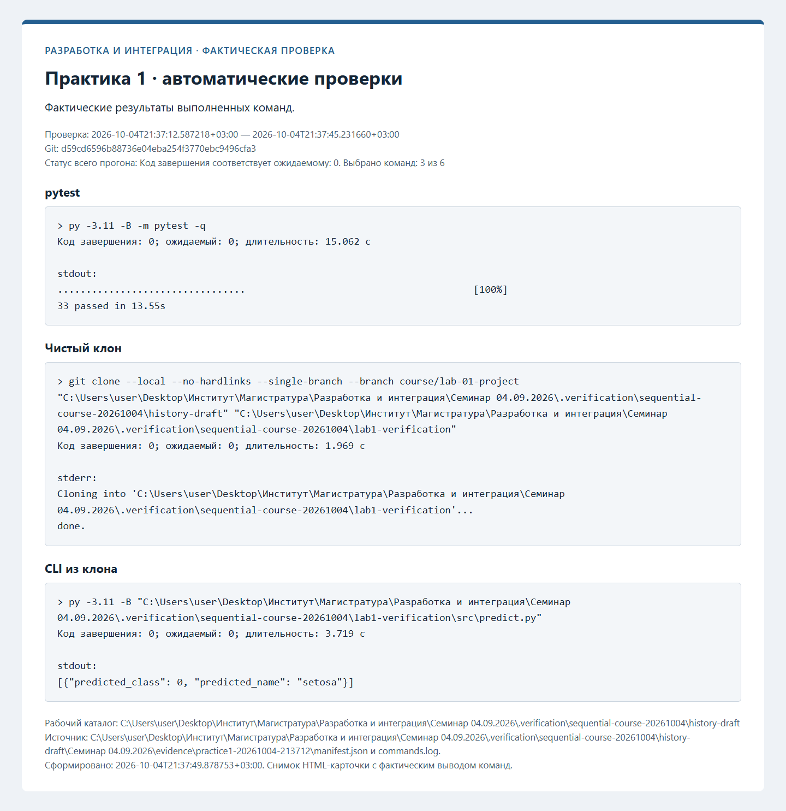

# Протоколы проверок

Ниже сохранены протоколы фактических проверок. Незавершённые этапы обозначены отдельно. Записи ранних практик при
добавлении следующей сохраняются; старые SHA и runs из прежней истории не переносятся.

## Структура ML-проекта — фактическая проверка

Проверенный коммит: `d59cd6596b88736e04eba254f3770ebc9496cfa3`. Дата: 2026-10-04T21:37:12.587218+03:00.

| Проверка | Фактический код | Результат |
| --- | --- | --- |
| Notebook и модель | 0 | succeeded |
| Обучение | 0 | succeeded |
| Предсказание | 0 | succeeded |
| pytest | 0 | succeeded |
| Чистый клон | 0 | succeeded |
| CLI из клона | 0 | succeeded |

[Полный журнал](evidence/practice1-20261004-213712/commands.log), [манифест](evidence/practice1-20261004-213712/manifest.json).

