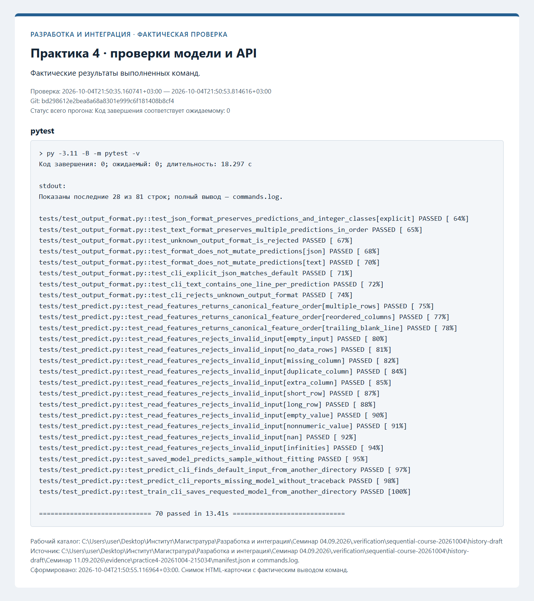

# Протоколы проверок

Ниже сохранены протоколы фактических проверок. Незавершённые этапы обозначены отдельно. Записи ранних практик при
добавлении следующей сохраняются; старые SHA и runs из прежней истории не переносятся.

## Git и коллективная разработка — фактическая проверка

Проверенный коммит: `58e9cf679cf9ef9baac3bcaaf77e69d1beb15bdf`. Дата: 2026-10-04T21:44:46.848862+03:00.

| Проверка | Фактический код | Результат |
| --- | --- | --- |
| Формат JSON | 0 | succeeded |
| Формат text | 0 | succeeded |
| Граф Git | 0 | succeeded |
| pytest | 0 | succeeded |

[Полный журнал](evidence/practice2-20261004-214446/commands.log), [манифест](evidence/practice2-20261004-214446/manifest.json).

[Новый pull request](https://github.com/Kirill-Erofeev/development-and-integration-labs/pull/9).

Учебный конфликт получен командой merge с фактическим кодом 1 и разрешён коммитом `58e9cf679cf9ef9baac3bcaaf77e69d1beb15bdf`. [Журнал конфликта](evidence/practice2-conflict-20261004-214357/commands.log).

Саморазбор в PR выявил отсутствие теста неизменности входного списка; добавлены проверки обоих форматов.

## HTTP API модели — фактическая проверка

Проверенный коммит: `d4b74130073e0a5e867cf2a77102bfb8375f1ba7`. Дата: 2026-10-04T21:48:36.659155+03:00.

| Проверка | Фактический код | Результат |
| --- | --- | --- |
| Готовность модели | 0 | succeeded |
| Контрольный прогноз | 0 | succeeded |
| Ошибка валидации | 0 | succeeded |
| Журнал Uvicorn | 0 | succeeded |

[Полный журнал](evidence/practice3-20261004-214836/commands.log), [манифест](evidence/practice3-20261004-214836/manifest.json).

## Модульные и интеграционные тесты — фактическая проверка

Проверенный коммит: `bd298612e2bea8a68a8301e999c6f181408b8cf4`. Дата: 2026-10-04T21:50:35.160741+03:00.

| Проверка | Фактический код | Результат |
| --- | --- | --- |
| pytest | 0 | succeeded |

[Полный журнал](evidence/practice4-20261004-215034/commands.log), [манифест](evidence/practice4-20261004-215034/manifest.json).

