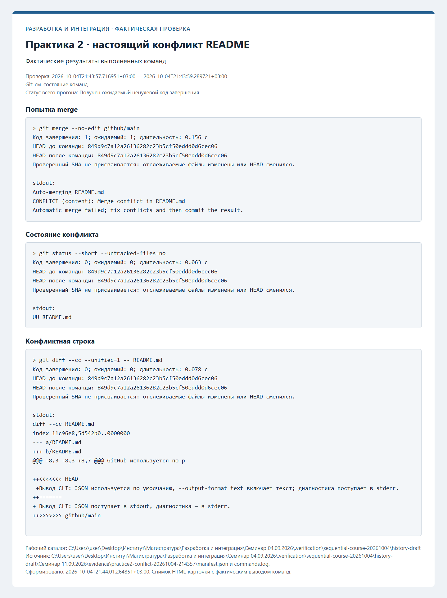
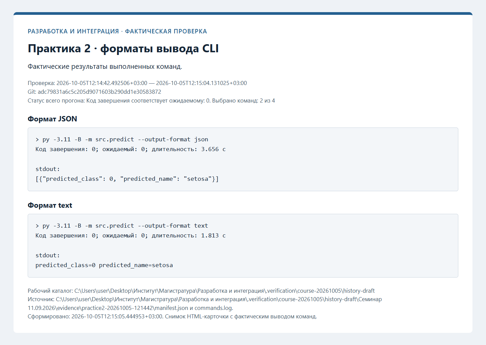
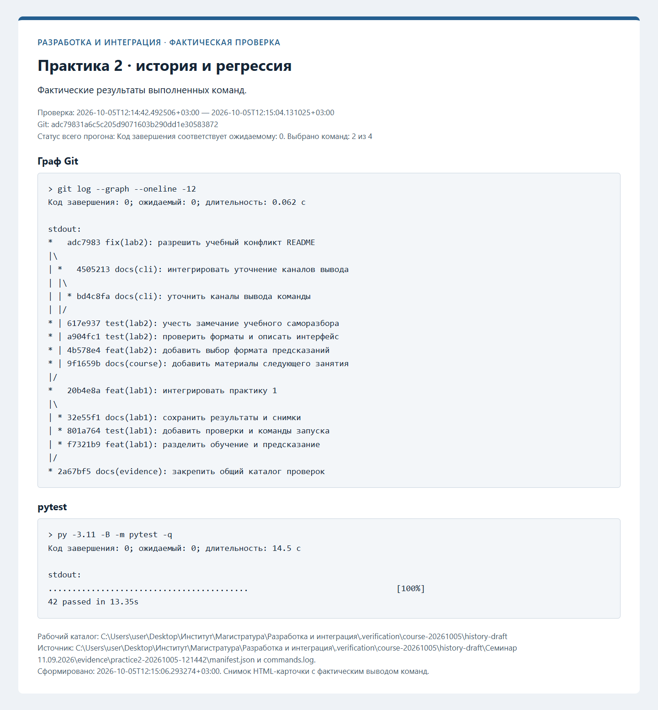
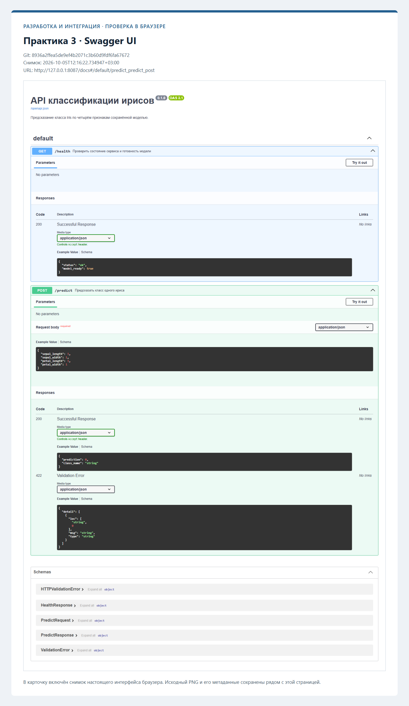
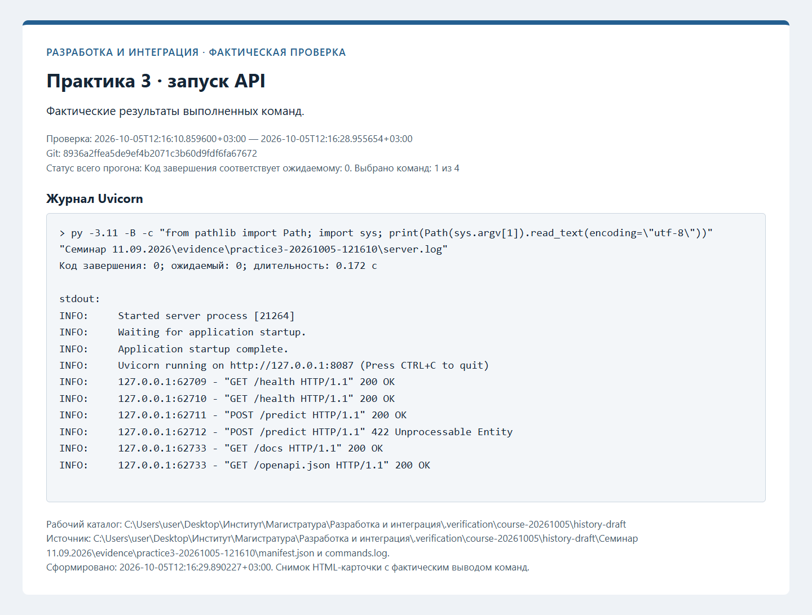
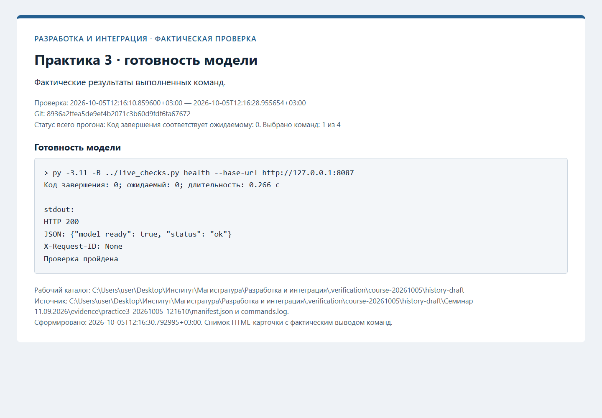
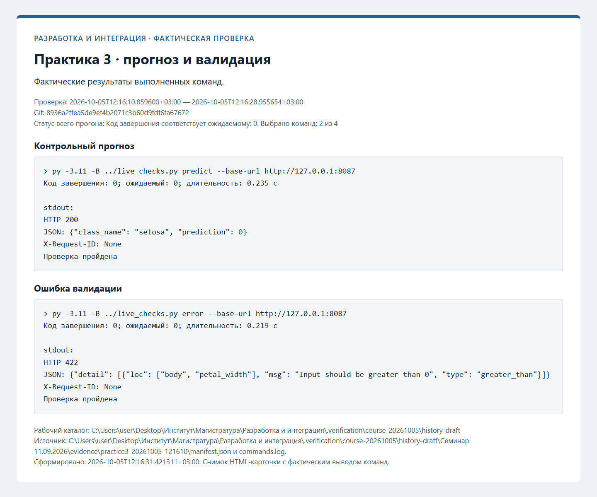

# Протоколы проверок

Ниже сохранены протоколы фактических проверок. Незавершённые этапы обозначены отдельно. Записи ранних практик при
добавлении следующей сохраняются; старые SHA и runs из прежней истории не переносятся.

## Практика 4: Модульные и интеграционные тесты

Статус: **ожидает фактической проверки этапа**.

- Проверенный новый commit: не заполнен.
- Дата, ОС, Python и версии инструментов: не заполнены.
- Команды, коды завершения и итог тестов: не заполнены.
- Новый PR и workflow runs, если применимо: не заполнены.
- Саморазбор и внешнее ревью: фактические результаты не внесены.

- [ ] полный pytest.
- [ ] однократная загрузка модели.
- [ ] ошибки API.

Планируемые снимки:

- [practice4-pytest.png](screenshots/practice4-pytest.png).

## Git и коллективная разработка — фактическая проверка

Проверенный коммит: `adc79831a6c5c205d9071603b290dd1e30583872`. Дата: 2026-10-05T12:14:42.492506+03:00.

| Проверка | Фактический код | Результат |
| --- | --- | --- |
| Формат JSON | 0 | succeeded |
| Формат text | 0 | succeeded |
| Граф Git | 0 | succeeded |
| pytest | 0 | succeeded |

[Полный журнал](evidence/practice2-20261005-121442/commands.log), [манифест](evidence/practice2-20261005-121442/manifest.json).

[Новый pull request](https://github.com/Kirill-Erofeev/development-and-integration-labs/pull/23).

Учебный конфликт получен командой merge с фактическим кодом 1 и разрешён коммитом `adc79831a6c5c205d9071603b290dd1e30583872`. [Журнал конфликта](evidence/practice2-conflict-20261005-121436/commands.log).

Саморазбор в PR выявил отсутствие теста неизменности входного списка; добавлены проверки обоих форматов.

## HTTP API модели — фактическая проверка

Проверенный коммит: `8936a2ffea5de9ef4b2071c3b60d9fdf6fa67672`. Дата: 2026-10-05T12:16:10.859600+03:00.

| Проверка | Фактический код | Результат |
| --- | --- | --- |
| Готовность модели | 0 | succeeded |
| Контрольный прогноз | 0 | succeeded |
| Ошибка валидации | 0 | succeeded |
| Журнал Uvicorn | 0 | succeeded |

[Полный журнал](evidence/practice3-20261005-121610/commands.log), [манифест](evidence/practice3-20261005-121610/manifest.json).

