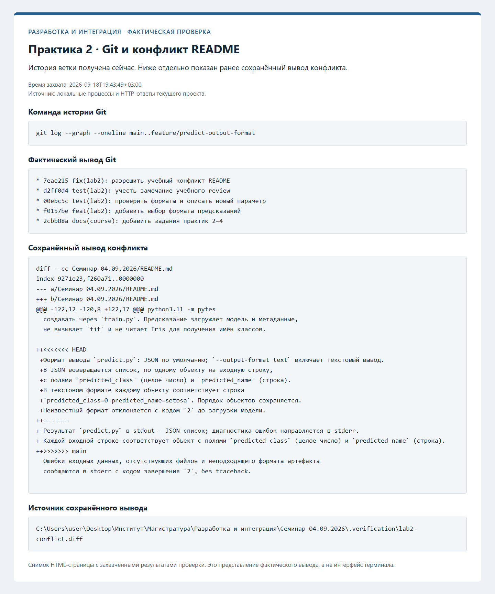

# Практика 2: коллективная разработка с Git

## Изменение

Ветка: `feature/predict-output-format`. Добавлен параметр
`--output-format json|text`; JSON остаётся стандартным форматом.
Модель, значения и порядок предсказаний не меняются. Неизвестный формат
отклоняется до загрузки модели с кодом завершения `2`.

Из корня репозитория:

```powershell
py -3.11 src/predict.py
py -3.11 src/predict.py --output-format text
py -3.11 -m pytest -q tests/test_predict.py tests/test_output_format.py
```

## Учебное review

Имитация review согласована пользователем. Независимый статический review
выполнен для `src/predict.py` и `tests/test_output_format.py` после коммита
`f96e02c`; это учебная проверка, а не отзыв одногруппника.

Замечание: сравнение результата с входным списком после вызова не доказывает,
что форматтер не изменил сам список и вложенные словари. Добавить независимую
глубокую копию, переставить исходные объекты и проверить неизменность входа
для обоих форматов.

Исправление — отдельный коммит `007b270`. После него тесты форматирования
завершились результатом `9 passed in 4.75s`.

## Воспроизведённый конфликт

В ветке `docs/cli-output-contract` от исходной main изменён тот же абзац
README: уточнено разделение stdout и stderr. Коммит `291ceb6` включён в
локальную main fast-forward слиянием. Затем в feature-ветке выполнено
`git merge --no-commit main`: Git сообщил конфликт в README.

Историческое свидетельство: ниже сохранён исходный вывод конфликта до
нормализации путей истории; его пути и blob OID не изменены. Снимок Git ниже
также относится к исходной истории. Актуальный проект расположен в корне.

Фактический diff до разрешения:

```diff
diff --cc Семинар 04.09.2026/README.md
index 9271e23,f260a71..0000000
--- a/Семинар 04.09.2026/README.md
+++ b/Семинар 04.09.2026/README.md
@@@ -122,12 -120,8 +122,17 @@@ python3.11 -m pytes
  создавать через `train.py`. Предсказание загружает модель и метаданные,
  не вызывает `fit` и не читает Iris для получения имён классов.

++<<<<<<< HEAD
 +Формат вывода `predict.py`: JSON по умолчанию; `--output-format text` включает текстовый вывод.
 +В JSON возвращается список, по одному объекту на входную строку,
 +с полями `predicted_class` (целое число) и `predicted_name` (строка).
 +В текстовом формате каждому объекту соответствует строка
 +`predicted_class=0 predicted_name=setosa`. Порядок объектов сохраняется.
 +Неизвестный формат отклоняется с кодом `2` до загрузки модели.
++=======
+ Результат `predict.py` в stdout — JSON-список; диагностика ошибок направляется в stderr.
+ Каждой входной строке соответствует объект с полями `predicted_class` (целое число) и `predicted_name` (строка).
++>>>>>>> main
  Ошибки входных данных, отсутствующих файлов и неподходящего формата артефакта
  сообщаются в stderr с кодом завершения `2`, без traceback.

```

Конфликт разрешён вручную: сохранены и выбор формата, и правило вывода
результатов в stdout, ошибок — в stderr. Маркеры конфликта удалены.
Повторная проверка после разрешения: **27 passed in 9.42s**.
Коммит разрешения: `fix(lab2): разрешить учебный конфликт README`.

## Проверка и границы результата

- Исходный прогон до изменений: 18 тестов прошли.
- Код и первые тесты: 25 тестов прошли.
- После review и разрешения конфликта: 27 тестов прошли.
- Риск изменения ограничен представлением stdout; старый JSON сохранён
  и проверен сравнением стандартного и явного формата.
- PR на GitHub, публикация комментария и удалённое слияние ещё не выполнены.
  Этот документ фиксирует реально выполненные локальные действия.
- Word-отчёт отменён пользователем; сведения о выполнении сохранены здесь.

## Скриншот Git-проверки

История ветки получена при проверке; ниже на снимке отдельно показан
сохранённый до разрешения вывод конфликта README.


