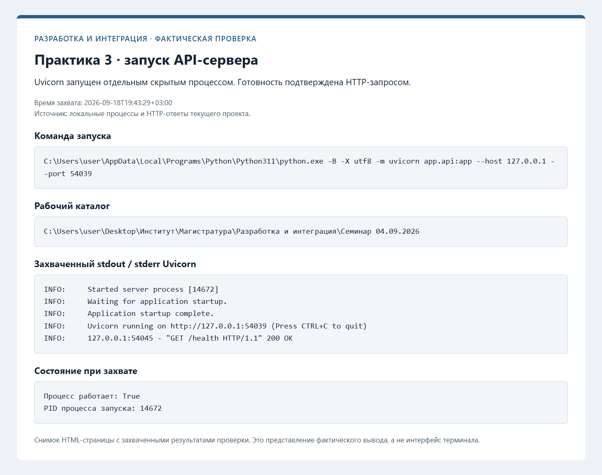
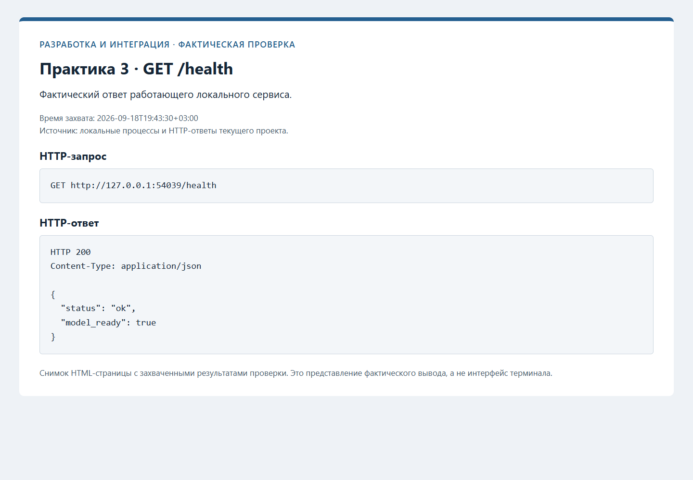
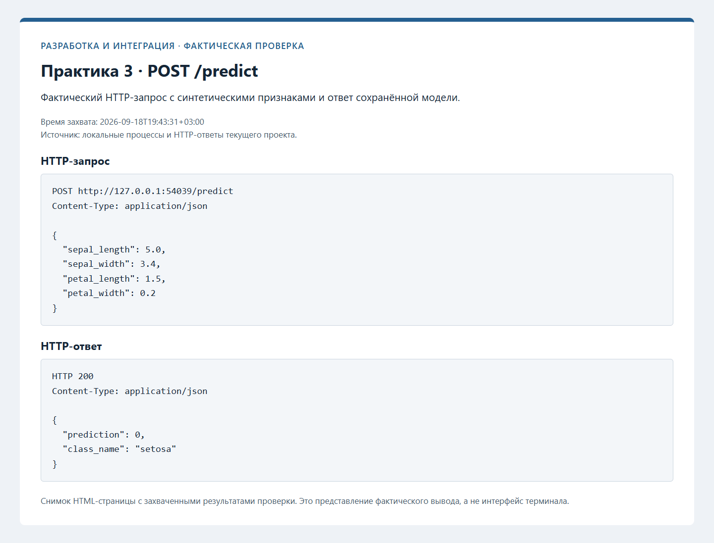
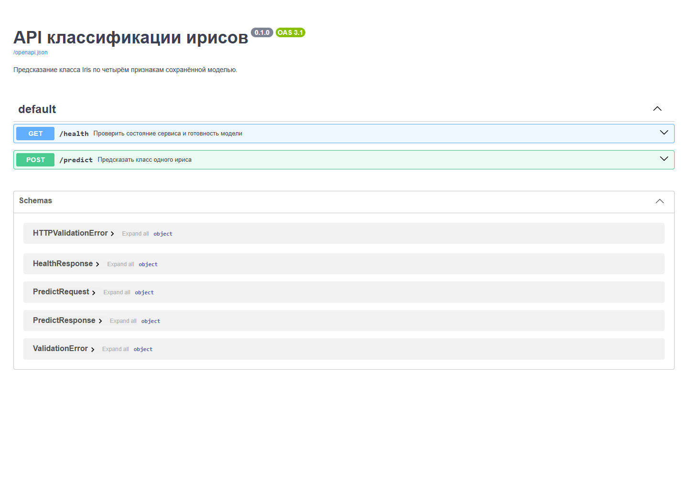

# Практика 3: API сохранённой модели

## Реализация

Ветка `feature/model-api` продолжает практику 2. CLI и FastAPI используют
общий `src/model_service.py`: он проверяет артефакт, сохраняет обученный
классификатор и метаданные классов, выполняет предсказания без повторного обучения.
Модель из практики 1 и её зависимости scikit-learn/joblib сохранены.

`app/schemas.py` задаёт четыре числовых признака запроса и типизированные ответы.
`app/api.py` содержит фабрику `create_app`, маршруты и `lifespan`.
Загрузка происходит один раз при старте каждого процесса сервера; отсутствие
или несовместимый формат модели останавливает запуск с понятной причиной.

| Маршрут | Результат |
| --- | --- |
| `GET /health` | `200`, состояние сервиса и `model_ready` |
| `POST /predict` | `200`, `prediction: int` и `class_name: str` |
| `GET /docs` | Swagger UI |
| `GET /openapi.json` | Схема API |

Порядок ключей JSON не влияет на порядок признаков модели. Значения должны быть
конечными положительными числами; строки, bool, пропуски и лишние поля отклоняются.
Ошибки валидации и синтаксиса JSON возвращают `422` с `detail`, содержащим `loc`,
`msg`, `type`. Обработчик не возвращает неконечное исходное значение в JSON ошибки.

Путь выбирается в порядке: аргумент `create_app(model_path=...)`, `ML_MODEL_PATH`,
стандартный `models/model.pkl` относительно проекта. CLI сохраняет прежние поля
`predicted_class`/`predicted_name` и выбор JSON/text. API возвращает один объект.

## Запуск

Из корня репозитория, глобальным Python 3.11:

```powershell
py -3.11 -m uvicorn app.api:app --host 127.0.0.1 --port 8000
```

Команды запросов PowerShell, настройка пути модели и описание входов приведены
в [README проекта](<../README.md#http-api>).

## Проверка

18 сентября 2026 года сервис запущен отдельным процессом Uvicorn. Выполнены
восемь проверок через настоящий HTTP: готовность, два предсказания, три ошибочных
запроса, Swagger HTML и OpenAPI. После ошибок сервис сохранил готовность.
Проверочный процесс остановлен. Версии 26 пакетов requirements согласованы
с зависимостями установленного глобального Python; установка не требовалась.

Ниже сохранены фактически полученные HTTP-ответы. Полные автоматические проверки
жизненного цикла и регрессии описаны в [практике 4](PRACTICE_4.md).

### Ответы проверочного сервера

Сервис запущен отдельным процессом Uvicorn на 127.0.0.1; запросы выполнены через HTTP.
Проверены закреплённые версии и зависимости 26 пакетов проекта.

#### GET /health

HTTP 200

```json
{
  "status": "ok",
  "model_ready": true
}
```

#### POST /predict (setosa)

HTTP 200

```json
{
  "prediction": 0,
  "class_name": "setosa"
}
```

#### POST /predict (virginica)

HTTP 200

```json
{
  "prediction": 2,
  "class_name": "virginica"
}
```

#### POST /predict: missing field

HTTP 422

```json
{
  "detail": [
    {
      "loc": [
        "body",
        "petal_width"
      ],
      "msg": "Field required",
      "type": "missing"
    }
  ]
}
```

#### POST /predict: malformed JSON

HTTP 422

```json
{
  "detail": [
    {
      "loc": [
        "body",
        16
      ],
      "msg": "JSON decode error",
      "type": "json_invalid"
    }
  ]
}
```

#### POST /predict: NaN

HTTP 422

```json
{
  "detail": [
    {
      "loc": [
        "body",
        "petal_width"
      ],
      "msg": "Input should be a finite number",
      "type": "finite_number"
    }
  ]
}
```

#### GET /docs

HTTP 200

```json
{
  "content_type": "text/html; charset=utf-8"
}
```

#### GET /openapi.json

HTTP 200

```json
{
  "paths": [
    "/health",
    "/predict"
  ]
}
```

После ошибочных запросов /health подтверждает готовность модели.
Проверочный процесс Uvicorn остановлен.

## Скриншоты

Вывод запуска сохранён с реального процесса Uvicorn; страницы ответов показывают
фактически выполненные запросы. Swagger снят с открытой страницы работающего API.






## Git и границы выполнения

Изменения разделены на общий сервис модели, HTTP API и документацию.
Обновление 29.09.2026: [PR #2](https://github.com/Kirill-Erofeev/development-and-integration-labs/pull/2) из `feature/model-api` слит в `main` обычным merge commit [`96a4bae`](https://github.com/Kirill-Erofeev/development-and-integration-labs/commit/96a4baefad0f9c4a204ee7caf689fb3344596ea0).
Восемь HTTP-проверок и снимки выше сохраняют результаты этапа 18.09.2026.
Публикация и последующая проверка feature-клона описаны в [GITHUB.md](GITHUB.md);
итоговый клон `main` на коммите [`8145a82`](https://github.com/Kirill-Erofeev/development-and-integration-labs/commit/8145a8252febca4b93b7580a40008f508aeb9e68) (`8145a8252febca4b93b7580a40008f508aeb9e68`) проверен: **95 passed in 15.75s** и **8 реальных HTTP-сценариев**. Протокол: [CHECKS.md семинара 25.09.2026](<../Семинар 25.09.2026/CHECKS.md>).
Word-отчёт отменён пользователем; результаты сохранены в Markdown.
