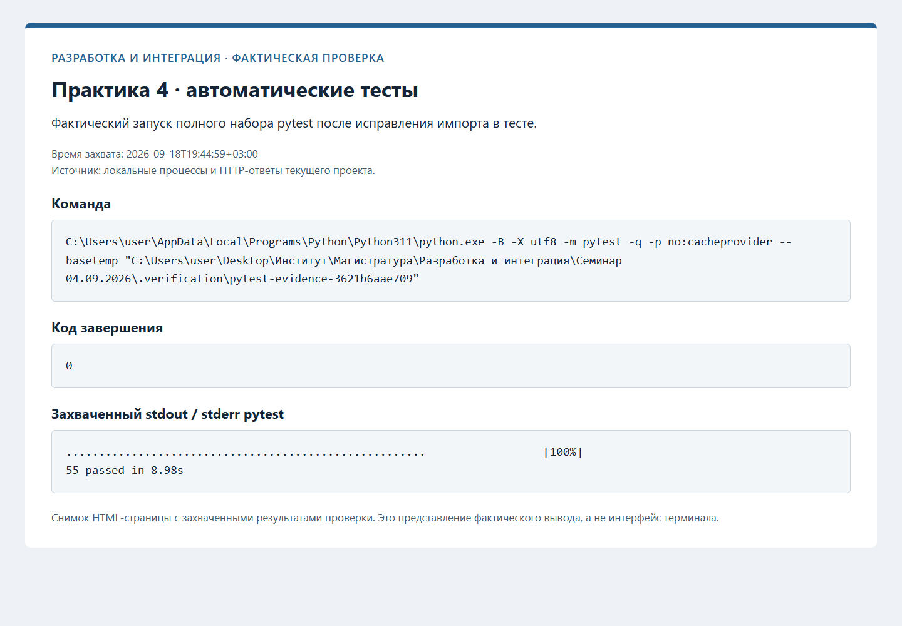

# Практика 4: модульные и интеграционные тесты API

## Организация

Ветка `feature/api-tests` продолжает `feature/model-api`. Тестовая инфраструктура,
тесты API и документация оформлены отдельными логическими коммитами.

Общие fixtures в `tests/conftest.py` создают временный синтетический артефакт,
входной JSON и `TestClient`. Синтетический классификатор возвращает класс `2`
с именем `gamma`: это позволяет обнаружить случайную загрузку стандартной модели.
Он обучается только при подготовке fixture на списках чисел в памяти.
Отдельная проверка использует сохранённую реальную модель и ожидает `0`/`setosa`.

| Файл | Сценарии | Количество |
| --- | --- | ---: |
| `test_predict.py` | Исходный CLI и сохранённая модель | 18 |
| `test_output_format.py` | JSON/text, ошибки, неизменность входа | 9 |
| `test_model_service.py` | Предсказания, схема артефакта, отсутствующая модель и метаданные | 8 |
| `test_api.py` | HTTP-контракт, выбор модели, валидация, документация и жизненный цикл | 20 |
| **Всего** | С учётом параметризованных случаев | **55** |

Проверяются `/health`, корректный `/predict`, типы ответа, перестановка ключей JSON,
пропущенные/лишние поля, строки вместо чисел, bool, ноль, отрицательное значение,
NaN/Infinity и повреждённый JSON. Неверные запросы возвращают `422`.
Также проверены явный путь и `ML_MODEL_PATH`, однократная загрузка, отсутствие
`fit` во время запросов, отказ при недоступном артефакте, Swagger/ReDoc/OpenAPI.

API-тесты используют контекстный менеджер `TestClient`, поэтому запускают lifespan.
Внешний HTTP-сервер им не требуется. Проверка отдельного Uvicorn через сеть
зафиксирована в [практике 3](PRACTICE_3.md).

## Обнаруженная и исправленная ошибка

Первый прогон новых тестов дал `22 passed, 2 failed`: при NaN/Infinity стандартный
ответ валидации включал исходное неконечное число, и сериализация JSON завершалась
исключением. Обработчик теперь возвращает только расположение, описание и тип
ошибки. Оба сценария закреплены регрессионными тестами; после ошибки дополнительно
проверяется готовность сервиса. Добавлены строгая проверка чисел и контроль порядка
признаков при перестановке ключей запроса.

## Результат проверки

Из корня репозитория:

```powershell
py -3.11 -m pytest -q --tb=short
```

Финальный прогон 18 сентября 2026 года после выноса общих fixtures:

```text
55 passed in 8.98s
```

Для снимка дополнительно отключён pytest cache и выбран временный каталог
внутри `.verification`; набор проверяемых тестов тот же. При переносе fixtures
был восстановлен нужный импорт `FEATURE_COLUMNS`; приведён итог после исправления.



Тесты выполнялись глобальным Python 3.11 без отдельной `.venv`. Проверены
закреплённые зависимости проекта; это не означает исправность всех сторонних
пакетов глобального окружения. Чистое окружение и Linux не проверялись.
Прогон из свежего клона ожидает разрешения на публикацию и создание новой копии.

## Артефакты и Git

Word-отчёты не создаются по решению пользователя. Код, fixtures,
результаты pytest и скриншот подготовлены локально. План настоящих PR,
учебного review и слияний на GitHub: [GITHUB.md](GITHUB.md).
