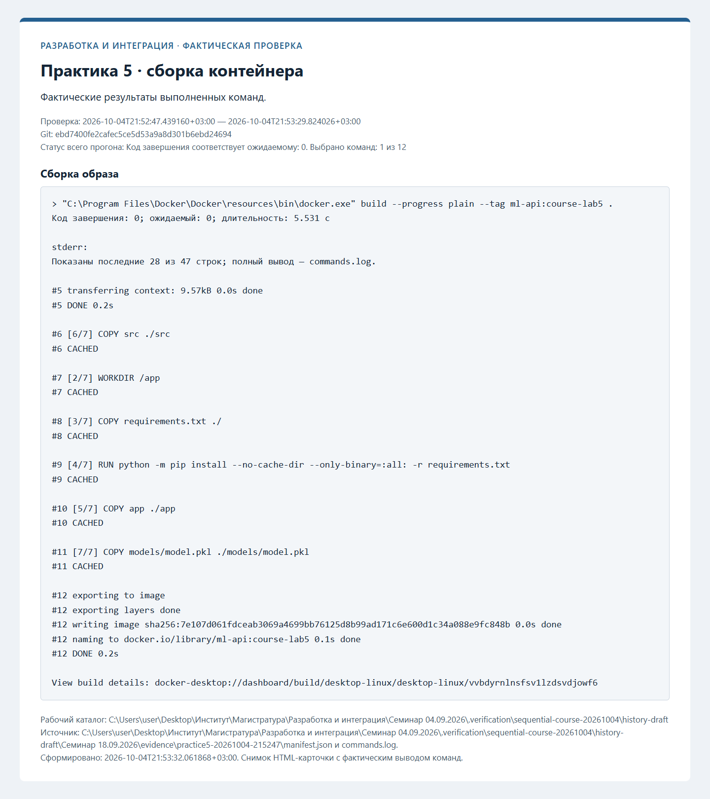
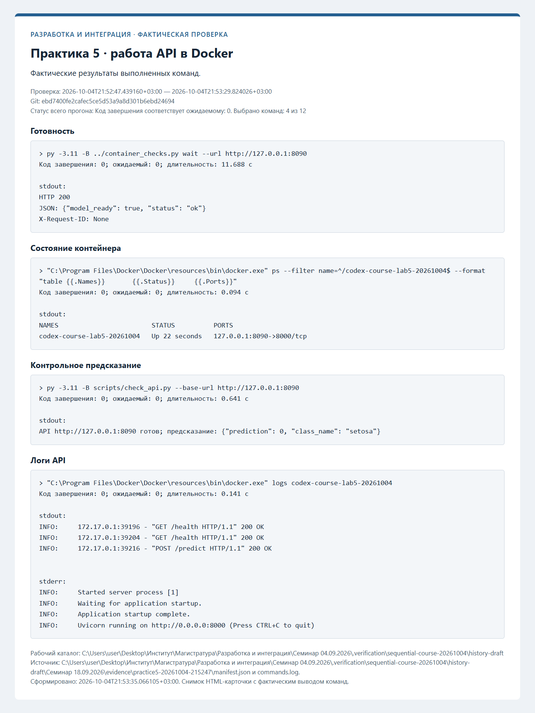
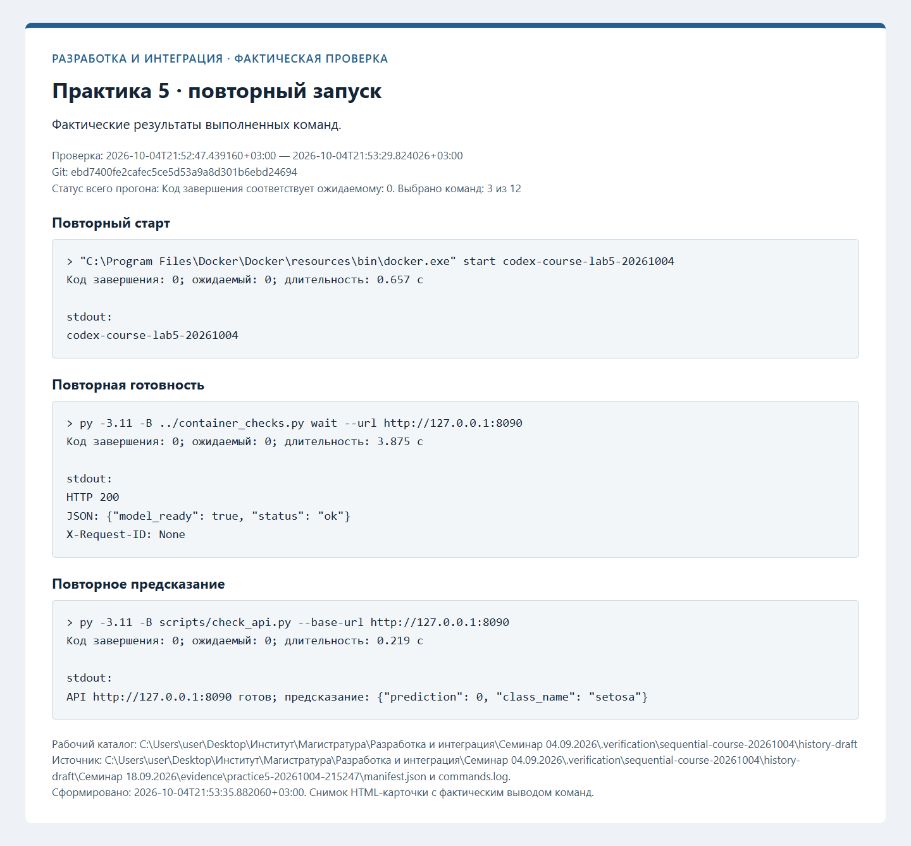

# Протоколы проверок

Ниже сохранены протоколы фактических проверок. Незавершённые этапы обозначены отдельно. Записи ранних практик при
добавлении следующей сохраняются; старые SHA и runs из прежней истории не переносятся.

## Практика 6: Docker Compose

Статус: **ожидает фактической проверки этапа**.

- Проверенный новый commit: не заполнен.
- Дата, ОС, Python и версии инструментов: не заполнены.
- Команды, коды завершения и итог тестов: не заполнены.
- Новый PR и workflow runs, если применимо: не заполнены.
- Саморазбор и внешнее ревью: фактические результаты не внесены.

- [ ] состояния api и client.
- [ ] prediction.json.
- [ ] ошибка localhost внутри client.
- [ ] сохранность результата после down.

Планируемые снимки:

- [practice6-status.png](screenshots/practice6-status.png).
- [practice6-localhost.png](screenshots/practice6-localhost.png).
- [practice6-persistence.png](screenshots/practice6-persistence.png).

## Контейнер API — фактическая проверка

Проверенный коммит: `ebd7400fe2cafec5ce5d53a9a8d301b6ebd24694`. Дата: 2026-10-04T21:52:47.439160+03:00.

| Проверка | Фактический код | Результат |
| --- | --- | --- |
| Сборка образа | 0 | succeeded |
| Запуск | 0 | succeeded |
| Готовность | 0 | succeeded |
| Состояние контейнера | 0 | succeeded |
| Контрольное предсказание | 0 | succeeded |
| Логи API | 0 | succeeded |
| Остановка | 0 | succeeded |
| Повторный старт | 0 | succeeded |
| Повторная готовность | 0 | succeeded |
| Повторное предсказание | 0 | succeeded |
| Завершение стенда | 0 | succeeded |
| Удаление своего контейнера | 0 | succeeded |

[Полный журнал](evidence/practice5-20261004-215247/commands.log), [манифест](evidence/practice5-20261004-215247/manifest.json).

