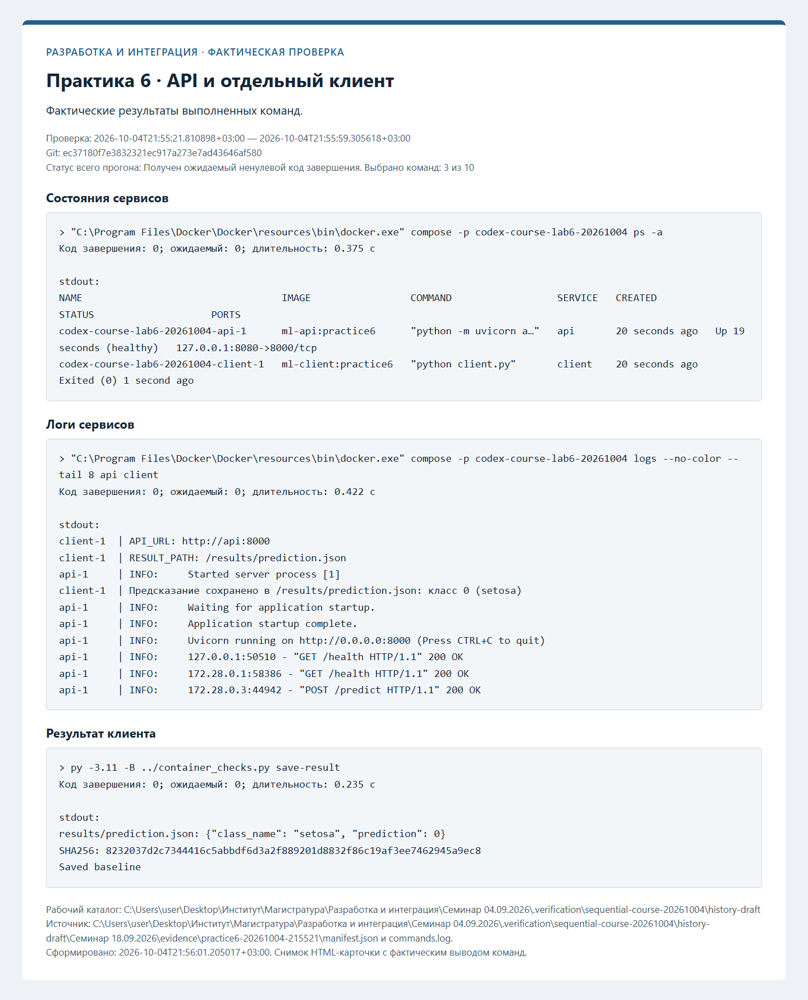
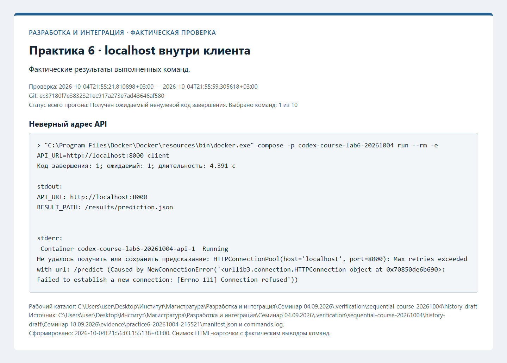
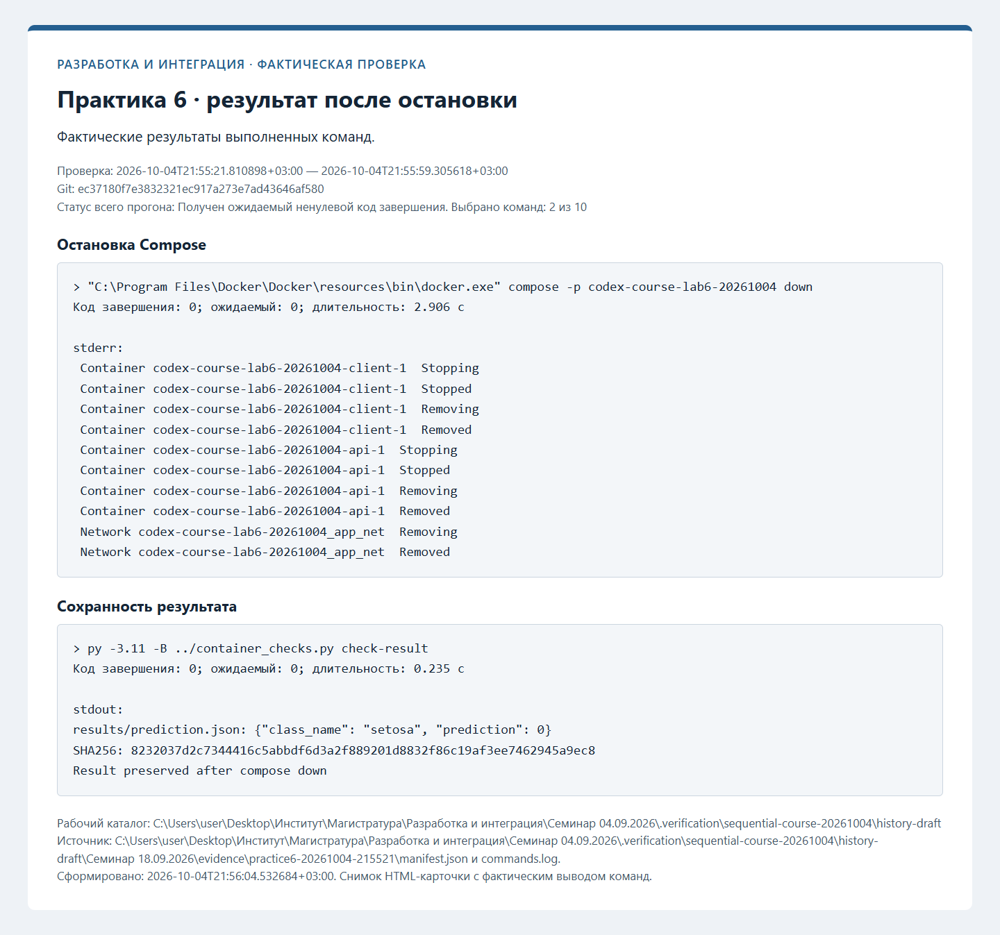

# Протоколы проверок

Ниже сохранены протоколы фактических проверок. Незавершённые этапы обозначены отдельно. Записи ранних практик при
добавлении следующей сохраняются; старые SHA и runs из прежней истории не переносятся.

## Контейнер API — фактическая проверка

Проверенный коммит: `ebd7400fe2cafec5ce5d53a9a8d301b6ebd24694`. Дата: 2026-10-04T21:52:47.439160+03:00.

| Проверка | Фактический код | Результат |
| --- | --- | --- |
| Сборка образа | 0 | succeeded |
| Запуск | 0 | succeeded |
| Готовность | 0 | succeeded |
| Состояние контейнера | 0 | succeeded |
| Контрольное предсказание | 0 | succeeded |
| Логи API | 0 | succeeded |
| Остановка | 0 | succeeded |
| Повторный старт | 0 | succeeded |
| Повторная готовность | 0 | succeeded |
| Повторное предсказание | 0 | succeeded |
| Завершение стенда | 0 | succeeded |
| Удаление своего контейнера | 0 | succeeded |

[Полный журнал](evidence/practice5-20261004-215247/commands.log), [манифест](evidence/practice5-20261004-215247/manifest.json).

## Docker Compose — фактическая проверка

Проверенный коммит: `ec37180f7e3832321ec917a273e7ad43646af580`. Дата: 2026-10-04T21:55:21.810898+03:00.

| Проверка | Фактический код | Результат |
| --- | --- | --- |
| Сборка API и клиента | 0 | succeeded |
| Запуск Compose | 0 | succeeded |
| Готовность API | 0 | succeeded |
| Завершение клиента | 0 | succeeded |
| Состояния сервисов | 0 | succeeded |
| Логи сервисов | 0 | succeeded |
| Результат клиента | 0 | succeeded |
| Неверный адрес API | 1 | expected_failure |
| Остановка Compose | 0 | succeeded |
| Сохранность результата | 0 | succeeded |

[Полный журнал](evidence/practice6-20261004-215521/commands.log), [манифест](evidence/practice6-20261004-215521/manifest.json).

