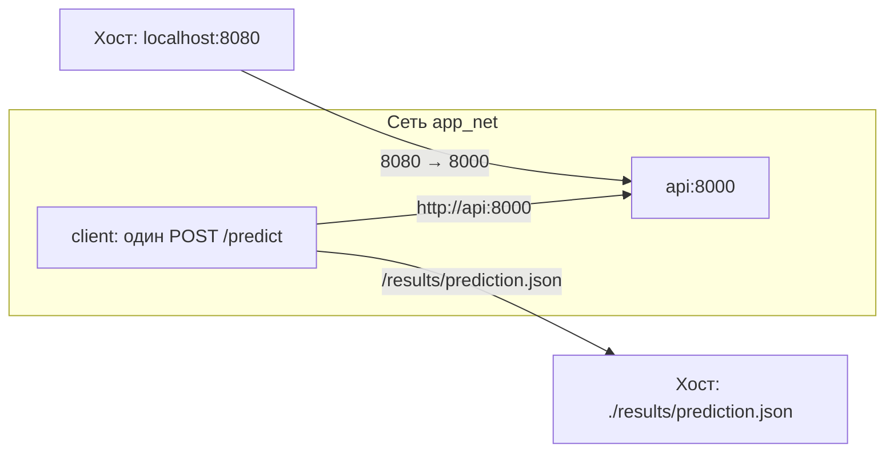

# Практические работы 5–6: Docker и Docker Compose

29 сентября 2026 года API и Compose-стенд проверены реальным запуском.
Подтверждены сборки, HTTP, повторный запуск API, взаимодействие сервисов,
ошибка `localhost` и сохранность JSON после `down`.
Полный pytest после переноса проекта в корень: **95 passed in 11.36s**.
Фактические результаты — в [CHECKS.md](CHECKS.md); команды ниже предназначены
для воспроизведения проверенного сценария.

| Материал | Назначение |
| --- | --- |
| [PLAN.md](PLAN.md) | Требования, реализация, проверки и состояние каждого результата |
| [PRACTICE_5.md](PRACTICE_5.md) | Сборка API, проверка с хоста, диагностика и повторный запуск |
| [PRACTICE_6.md](PRACTICE_6.md) | Compose, связь сервисов, сохранение ответа и опыт с `localhost` |

Рабочий проект находится в [корне репозитория](../README.md).
Эта папка содержит условия и материалы практик 5–6. `Dockerfile` и `compose.yaml`
находятся в корне общего репозитория предмета. Команды запускаются из него.

```text
development-and-integration-labs/
├── Dockerfile
├── .dockerignore
├── compose.yaml
├── requirements.txt
├── app/
├── src/
├── models/model.pkl
├── client/
│   ├── Dockerfile
│   ├── .dockerignore
│   ├── requirements.txt
│   └── client.py
└── results/.gitkeep
```

Действующие решения: официальный образ `python:3.11-slim`, существующая переменная
`ML_MODEL_PATH` вместо `MODEL_PATH` из методичек, готовая модель без обучения при
сборке и запросе. Зависимости API закреплены в исходном
[requirements.txt](<../requirements.txt>).
Word-отчёты отменены; для репозитория используется GitHub вместо GitVerse.

Материалы семинаров и `results/prediction.json` не исключаются из Git.
[.dockerignore](<../.dockerignore>) отдельно ограничивает контекст
сборки файлами API, его зависимостями и сохранённой моделью; он не управляет Git.
Клиент собирается из собственного контекста `client/`.



Для повторного запуска нужны Docker Engine с поддержкой Linux-контейнеров и Compose v2
(в Windows — соответствующая установка Docker Desktop), доступ к образам и пакетам,
свободный порт `8080` и готовый `models/model.pkl`. 

[compose.yaml](<../compose.yaml>) задаёт API до `1 CPU / 512 MiB`,
клиенту — до `0.25 CPU / 128 MiB`; API использует одного worker и ограничивает
вычислительные потоки. Сборка описана с `--parallel 1`. Эти настройки ограничивают
работающие сервисы и параллельность операций Compose, но не общий расход памяти
Docker Desktop/WSL и не ресурсы отдельной сборки.

Выполненные проверки: [CHECKS.md](CHECKS.md).

## Снимки выполненных проверок

- [P5: сборка](screenshots/practice5-build.png).
- [P5: HTTP, логи, файлы и ресурсы](screenshots/practice5-runtime.png).
- [P5: повторный запуск](screenshots/practice5-repeat.png).
- [P6: конфигурация и работа](screenshots/practice6-status.png).
- [P6: localhost и исправление](screenshots/practice6-localhost.png).
- [P6: результат после down](screenshots/practice6-persistence.png).

Снимки показывают HTML-страницы с захваченным фактическим выводом.
Чистый клон опубликованного коммита `fdc377f` прошёл полный pytest на Windows и Linux, сборки и Compose-проверки; см. [отчёт чистого клона и CI/CD](<../Семинар 25.09.2026/CHECKS.md>).

Публикация и три успешных Actions run: [подтверждённые PR и GitHub Actions](<../Семинар 25.09.2026/CHECKS.md>).
