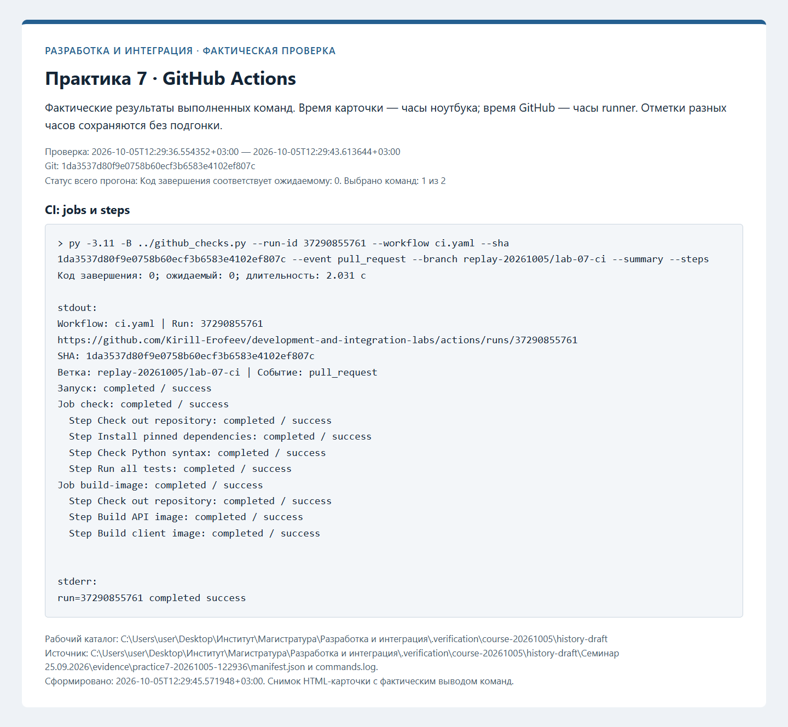
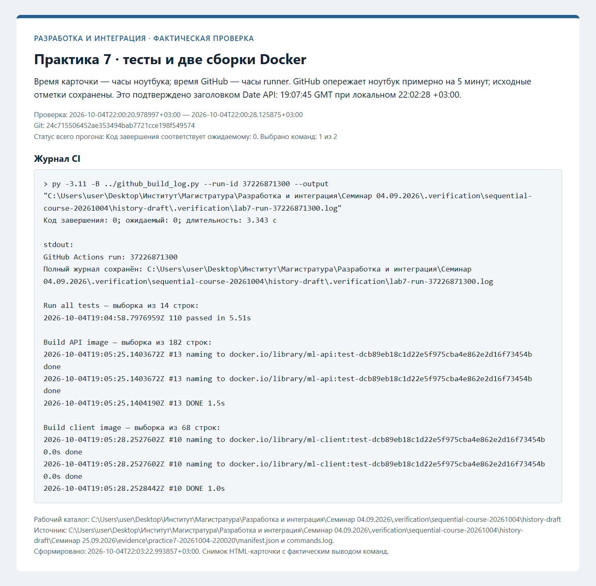
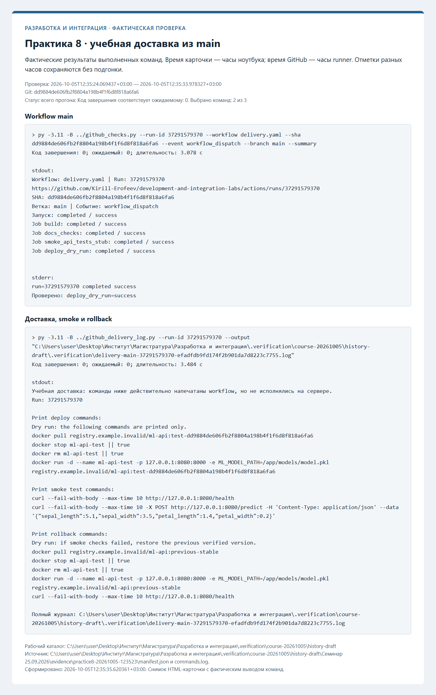
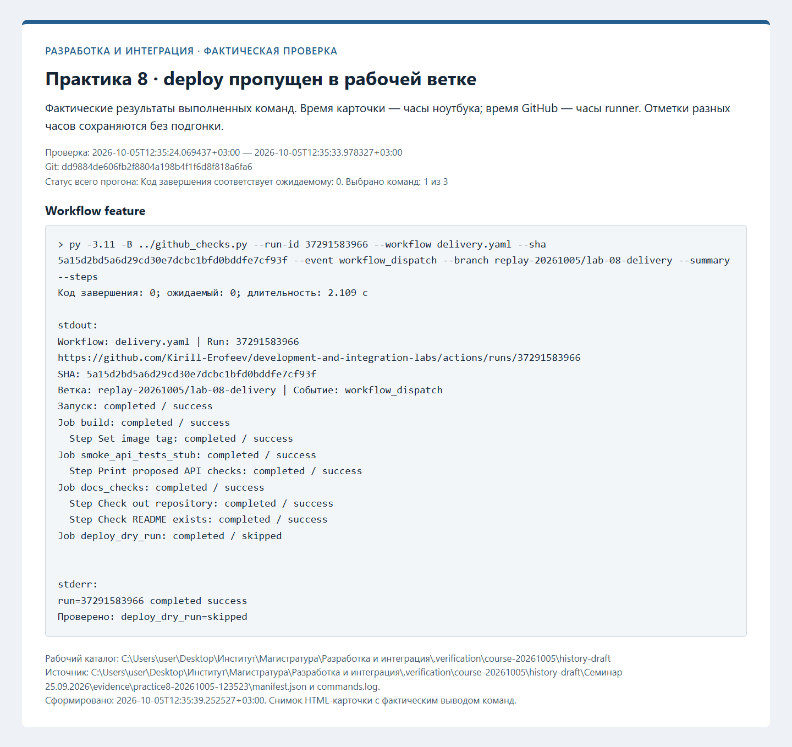

# Протоколы проверок

Ниже сохранены протоколы фактических проверок. Незавершённые этапы обозначены отдельно. Записи ранних практик при
добавлении следующей сохраняются; старые SHA и runs из прежней истории не переносятся.

## GitHub Actions CI — фактическая проверка

Проверенный коммит: `1da3537d80f9e0758b60ecf3b6583e4102ef807c`. Дата: 2026-10-05T12:29:36.554352+03:00.

| Проверка | Фактический код | Результат |
| --- | --- | --- |
| CI: jobs и steps | 0 | succeeded |
| Журнал CI | 0 | succeeded |

[Полный журнал](evidence/practice7-20261005-122936/commands.log), [манифест](evidence/practice7-20261005-122936/manifest.json).

[Новый pull request](https://github.com/Kirill-Erofeev/development-and-integration-labs/pull/29).

Дополнительно проверен [CI после merge в main](https://github.com/Kirill-Erofeev/development-and-integration-labs/actions/runs/37291266459) для `44beafb80473626b035fd0677bcb7ce01fe90a7a`: все jobs завершены успешно. Метаданные — [github-run.json](evidence/practice7-main/github-run.json).

## Учебная доставка — фактическая проверка

Проверенный коммит: `dd9884de606fb2f8804a198b4f1f6d8f818a6fa6`. Дата: 2026-10-05T12:35:24.069437+03:00.

| Проверка | Фактический код | Результат |
| --- | --- | --- |
| Workflow main | 0 | succeeded |
| Доставка, smoke и rollback | 0 | succeeded |
| Workflow feature | 0 | succeeded |

[Полный журнал](evidence/practice8-20261005-123523/commands.log), [манифест](evidence/practice8-20261005-123523/manifest.json).

[Новый pull request](https://github.com/Kirill-Erofeev/development-and-integration-labs/pull/30).

